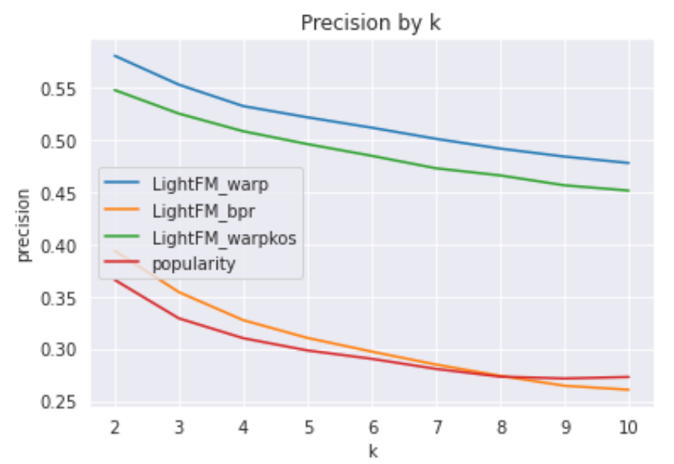
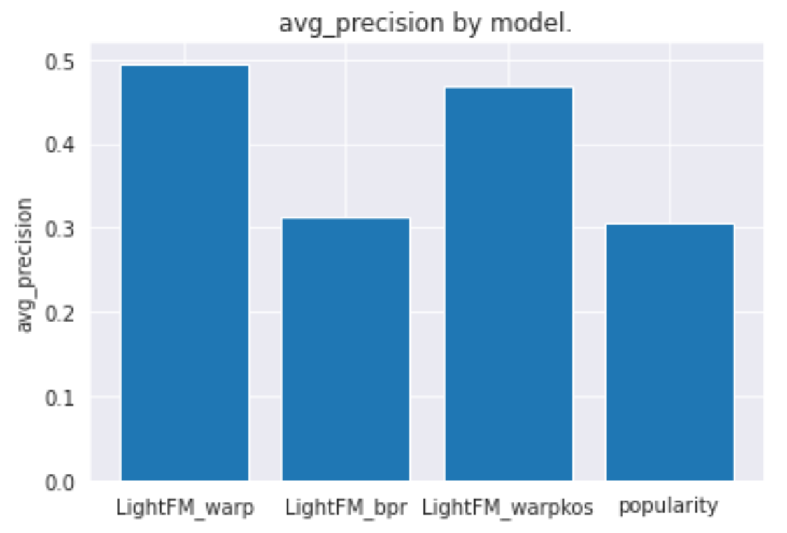
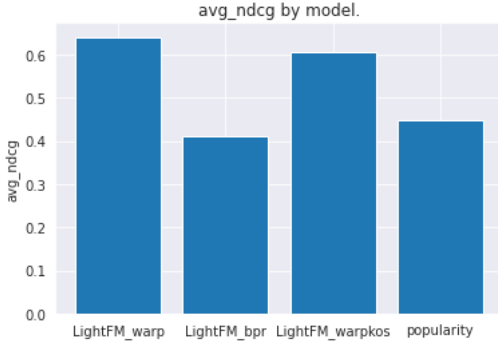
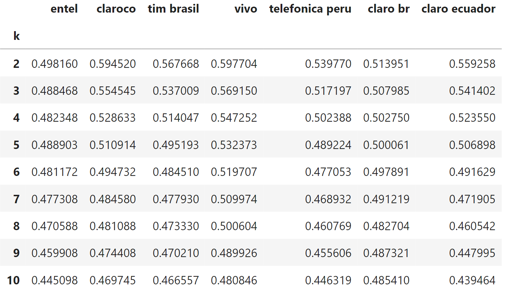

# App Recommender


[](https://travis-ci.org/joemccann/dillinger)

App recommendation engine. Uses the app database per user (collaborative filtering) + user or apps features to make a recommendation.
By default, the training model is the LightFM, a hybrid latent representation recommender model.
The loss function used is WARP - Weighted Approximate-Rank Pairwise (see details in https://making.lyst.com/lightfm/docs/lightfm.html)

## Features

- Test and evaluation module using the NDCG and precision@k metrics.
- Funtions to predict the most recommended apps using LightFM.
- For users who are not in the training base, it is possible to make app recommendations using       the popularity baseline or searching for the most similar users to evaluate.
- Inference module to make prediction in real-time (maximum of 15 miliseconds by user).

## Testing and evaluation

In the file jupyter-notebook Test_evaluation.ipnyb, the recommendation model is trained in order to evaluate the performance, comparing with the popularity baseline. To evaluate performance. We follow the following methodology:	
- Build a database with the 100 thousands most recent active users end filter the database with only apps installed on at least 500 devices;
- Mask (randomly) 20% of apps from the user app set;
- Unmasked apps will be used to train the recommendation algorithm;
- For evaluation, we used precision@K, which evaluates how many of the k best recommendations were actually among the user's masked apps, and the NDCG (normalized discounted cumulative gain).

To demonstrate the effectiveness of the recommender system, a comparison was made with the precision of a random recommendation and a recommendation based on popularity. We can see in the graphs below that the recommendation model using the WARP loss function from the LightFM library has superior performance compared to the popularity baseline.




The precision evaluation was also made by organization, as shown in the table below:


## Training script

After evaluation, the model is ready to be trained. In the training script, the complete data containing the applications of the existing users is trained and the following files should be saved for inference:

| File | Information |
| ------ | ------ |
| mapping.joblib | It makes the conversion between customer id and customer index in sparse array. |
| model_lightfm_warp.joblib | Trained artifact from a recommendation library (LightFM) |
| nbrs_training.joblib | Approximate Nearest-neighbors search training artifact.(pynndescent) |
| relevant_apps.joblib | sorted list of the most popular apps |
| interactions.npz | Sparse array with installed apps for each client|

After training the model, it's easy to create a dataframe containing the users' score for each ap:
```python
rec = Recommender(mapping, interactions, relevant_apps)
predictions_pd = rec.predict(model_lightfm_warp) 
```
After the dataframe be saved, we have everything needed for the inference.

## Real-Time Inference

After training, the app recommendation system is capable of real-time inference for each of the following objectives:

**Predict the most recommended apps for a trained user** 
To predict the top k app recommendations, it can be done in two ways: If the dataframe with the scores is available
```python
top_k_apps = predictions_pd.loc['clientid of user',:].sort_values(ascending=False)[:k],
```
or direct by the predict method
```python
top_k_apps = rec.predict(model_lightfm_warp, clientids=['clientid of user'], ranking_mode=True, k=10)).
```
**Predict the most recommended apps for new users** 
The recommendation can be made using the popularity baseline, with the predict_baseline method, simply providing a list of user apps (list of apps list, when it is necessary to recommend to multiple users):
```python
top_k_app_pop = rec.predict_baseline(users_apps=[['Whatsapp', 'Spotify'], ['Banco do Brasil', 'Meu Tim']], baseline ='popularity', ranking_mode=True, k=10)
```
The second method is to find the nearest neighbors of the already trained user base. **The similarity-based is the recommended model, it has been proven to perform 88% better than the popularity baseline.**. 
Just use predict_sim method and provide user list with apps list:
```python
top_k_app_sim = rec.predict_similarity_based(nbrs_training, model_lightfm_warp, 
            users_apps=[['Whatsapp', 'Spotify'], ['Banco do Brasil', 'Meu Tim']], n_neighbors=5,
            ranking_mode=True, k=10):
```
**Find the top N users to recommend an app**
In this case, If the dataframe with the scores is available, we just need to filter by the choosed app, sorted and filter the top N users:
```python
top_N_users = predict_df.loc[:,'Uber'].sort_values(ascending=False)[:N]
```
## Recommender
```python
class lightfm.LightFM(no_components=10, k=5, n=10, learning_schedule='adagrad', loss='logistic', learning_rate=0.05, rho=0.95, epsilon=1e-06, item_alpha=0.0, user_alpha=0.0, max_sampled=10, random_state=None)
``` 
**Parameters**
        ----------
     <br>   **mapping** : *Dict*
     <br>   &emsp; It makes the conversion between customer id and customer index in sparse array.
     <br>   **interactions** : *Sparse Matrix*
     <br>   &emsp;    Sparse array with installed apps for each client.
     <br>   **most_popular_apps** : *list*
      <br>   &emsp;   Ordered list of the most popular apps.
     <br>   **interactions_masked** : *sparse, optional*
      <br>  &emsp;    If not None, it is used for testing.
      <br>  &emsp;    Contains the masked applications for evaluation of
      <br>  &emsp;    model performance. The default is None.

```python
predict(self, model, clientids=None, user_ids=None, filter_user_apps=True, 
                ranking_mode=False, k=10, return_app_id=False)
``` 
<br>*It recommends applications to selected users.*
 <br>       **Parameters**
 <br>       ----------
  <br>      **model** : *Trained LightFM artifact*. 
  <br>       &emsp;   Trained artifact from a recommendation library (LightFM).
  <br>      **clientids** : *List of strings, optional*
  <br>      &emsp;   list of client ids for recommendation.
  <br>       &emsp;   The default is None. If both clientid and user are None, the function will predict for all trained users.
  <br>      **user_ids** : *Listo of integers, optional*
  <br>       &emsp;   List of user indices for recommendation.
   <br>      &emsp;   The default is None.
   <br>     **filter_user_apps** : *boolean, optional*
   <br>      &emsp;   Whether in the recommendation you should filter the apps that users already have installed.
   <br>      &emsp;   The default is True.
   <br>     **ranking_mode** : *boolean, optional*
   <br>      &emsp;   See the description of the function return.
   <br>      &emsp;   The default is False.
   <br>     **k** : *integer, optional*
   <br>      &emsp;   If ranking_mode is True, choose k, which provides the top k recommendations from users.
   <br>      &emsp;   The default is 10.
   <br>     **return_app_id** : *boolean, optional*
   <br>      &emsp;   Defines how apps should be displayed in the output. True case returns the id.
   <br>      &emsp;   If false, returns the name of the app. The default is False.
   <br>   ----------
   <br>     **Exception**
   <br>     &emsp;     If the model input is not a valid model for recommendation.
   <br>     **Returns**
    <br>    -------
   <br>     &emsp; If Ranking_mode is False: *DataFrame*. If is True: *dictionary*
    <br>     &emsp;   If Ranking_mode is False, the function returns a *dataframe* 
    <br>     &emsp;&emsp;       with the score of all applications for each user.
    <br>     &emsp;   If True, returns a *dictionary* containing the top k recommendations for each user.
```python
predict_baseline(clientids=None, user_ids=None, users_apps: List[List[str]]=None, baseline ='popularity',
                        filter_user_apps=True, ranking_mode=False, k=10, return_app_id=False):
```
<br>*It recommends applications to selected users using baselines.*
<br>        **Parameters**
 <br>       ----------
 <br>       **clientids** : *List of strings, optional*
 <br>       &emsp;    list of client ids for recommendation. If None, is 
 <br>        &emsp;       necessary or provide the client index or the list of apps. The default is None.
 <br>       **user_ids** : *List of integers, optional*
 <br>       &emsp;    List of user indices for recommendation. If None, it is necessary or provide the client id or
  <br>      &emsp;    the list of apps. The default is None.
  <br>      **users_apps** : *List of Lists, optional*
  <br>      &emsp;    List of apps for each user. If None, either client ids or user indices must be provided.
  <br>      &emsp;    The default is None.
  <br>      **baseline** : *'popularity' or 'random', optional*
  <br>      &emsp;    Selection of the Baseline. The default is 'popularity'.
  <br>      **filter_user_apps** : *boolean, optional*
  <br>      &emsp;    Whether the existed user apps should be filtered or not. The default is True.
   <br>     **ranking_mode** : *boolean, optional*
   <br>     &emsp;    See the description of the function return.
   <br>    &emsp;     The default is False.
   <br>     **k** : *integer, optional*
    <br>    &emsp;    If ranking_mode is True, choose k, which provides the top k recommendations from users.
    <br>    &emsp;    The default is 10.
    <br>    **return_app_id** : *boolean, optional*
   <br>     &emsp;    Defines how apps should be displayed in the output. True case returns the id.
   <br>     &emsp;    If false, returns the name of the app. The default is False.

  ----
<br>**Exception**
<br>        &emsp;    If the baseline is different from 'popularity' or 'random;
 <br>        &emsp;   If the user_apps, user_ids or client ids parameters are all None.
 <br>        -------
  <br>      **Returns**
  <br>      &emsp; If Ranking_mode is False: DataFrame. If is True: dictionary
  <br>       &emsp;    If Ranking_mode is False, the function returns a dataframe 
  <br>      &emsp;  &emsp;        with the score of all applications for each user.
  <br>      &emsp;     If True, returns a dictionary containing the top k recommendations for each user.
        
```python
predict_similarity_based(self, nbrs_model, model, users_apps: List[List[str]], n_neighbors=5,
                                ranking_mode=False, k=10):
``` 
<br>*It recommends applications to selected users using similarity with users of training data.*
<br>        **Parameters**
<br>        ----------
<br>        **nbrs_model** : *pynndescent.pynndescent_.NNDescent artifact*  
 <br>       &emsp;    Approximate Nearest-neighbors search training artifact.
 <br>       **model** : *Trained LightFM artifact*. 
 <br>        &emsp;   Trained artifact from a recommendation library (LightFM).
  <br>      **users_apps** : *List of Lists, optional*
  <br>       &emsp;   List of apps for each user. If None, either client ids or user indices must be provided.
  <br>       &emsp;   The default is None.
  <br>      **n_neighbors** : *Int, optional*
  <br>      &emsp;    Number of neighbors. The default is 5.
  <br>      **ranking_mode** : *boolean, optional*
  <br>       &emsp;   See the description of the function return.
   <br>     &emsp;    The default is False.
   <br>     **k** : *integer, optional*
   <br>     &emsp;    If ranking_mode is True, choose k, which provides the top k recommendations from users.
   <br>     &emsp;    The default is 10.
   <br>     ------
   <br>     **Exception**
    <br>     &emsp;   If the approximate nearest neighbor search model is not a valid model for recommendation.
    <br>    &emsp;    If the model input is not a valid model for recommendation.
    <br>           -------
    <br>    **Returns**
   <br>     &emsp; If Ranking_mode is False: DataFrame. If is True: dictionary
   <br>      &emsp;    If Ranking_mode is False, the function returns a dataframe 
   <br>     &emsp;  &emsp;        with the score of all applications for each user.
  <br>      &emsp;     If True, returns a dictionary containing the top k recommendations for each user.
        
``` ```python
```python
evaluating_precision_model_by_k(self, models, models_name, k_max,
                                        n_sample=100, baselines=['popularity'])
``` 
<br>*Calculate the precision@k metric, that is, How many relevant items are present in the top-k recommendations of your system.
        Avaliable only in test mode.*
  <br>      **Parameters**
   <br>     ----------
   <br>     **models** : *List*
   <br>      &emsp;   List of artifacts models for recommendation.
    <br>    **models_name** : *List of strings*
    <br>     &emsp;   List of the model's name.
   <br>     **k_max** : *int*
    <br>    &emsp;    Maximum k then be estimated.
    <br>    **n_sample** : *int, optional*
    <br>     &emsp;   Number of users to estimate the average precision.The default is 100.
    <br>    **baselines** : *List, optional*
    <br>    &emsp;    Baselines for evaluation. If None, the baseline precision is not evaluated.
    <br>     &emsp;   The default is ['popularity'].
                -------
    <br>    **Returns**
     <br>   *DataFrame*
     <br>    &emsp;   For each k, return the average precision for each model selected.
         
```python
evaluation_model(self, models, models_name, n_sample=100, use_baseline=True)
``` 

<br>*calculate de the MAP - Mean average precision and the mean NDCG for a sample of users.
        Avaliable only in test mode.*
 <br>       **Parameters**
 <br>       ----------
 <br>        **models** : *List*
  <br>       &emsp;    List of artifacts models for recommendation.
  <br>      **models_name** : *List of strings*
  <br>        &emsp;   List of the model's name.
  <br>      **k_max** : *int*
  <br>       &emsp;    Maximum k then be estimated.
  <br>      **n_sample** : *int, optional*
  <br>       &emsp;    Number of users to estimate the average precision.The default is 100.
  <br>      **use_baseline** : *boolean, optional*
  <br>       &emsp;    If use the populary or not. The default is True.
  <br>      ------
  <br>      **Exception**
  <br>       &emsp;    If the model input is not a valid model for recommendation..
  <br>              -------
   <br>     **Returns**
   <br>     *dict*
   <br>      &emsp;    The average mean precision and the average NDCG for each model.
